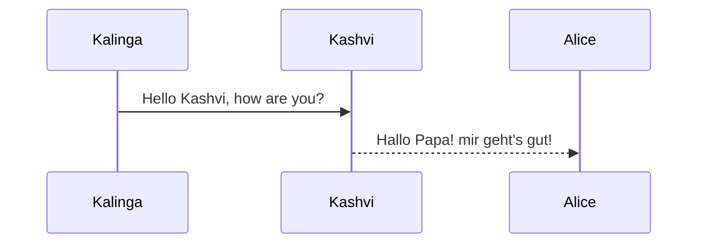

# DevOps

__[Jenkins](jenkins/jenkins.md)__

__[Vagrant](vagrant/vagrant.md)__

https://www.edureka.co/blog/interview-questions/hadoop-interview-questions-hadoop-cluster/

```mermaid
sequenceDiagram
    Kalinga->>Kashvi: Hello Kashvi, how are you?
    Kashvi-->>Alice: Hallo Papa! mir geht's gut!
```
